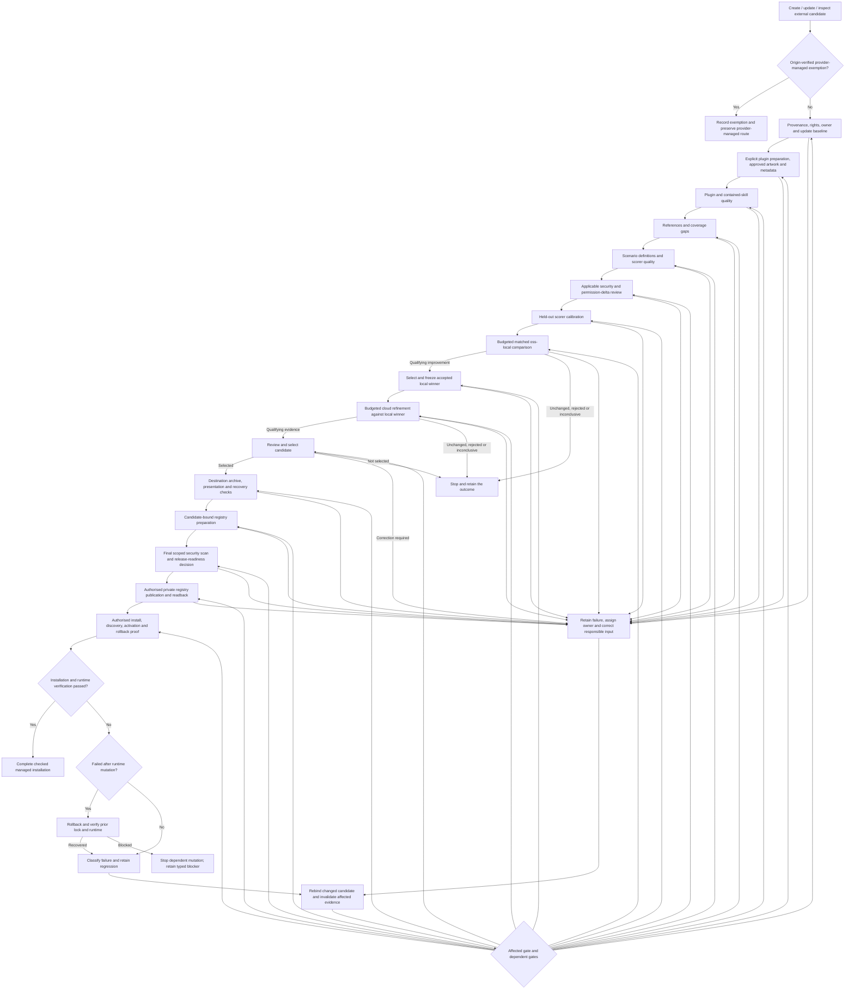

# Skills SDK workflow

Owner: Skills SDK maintainers. Consumers: agents creating, updating, checking,
or adopting skills and plugins. This document records the owner-approved target
workflow and its current implementation boundaries. Maintain it with each
public route change; use [the migration map](migration-map.md) for legacy
coverage and [the task record](projects/sdk-workflow/tasks.md) for execution state.

Accepted implementation baseline: [`ec8f0dae`](https://github.com/jscraik/skills-sdk/commit/ec8f0dae3b370cf9f9c8a85ce91f70e4846481f1),
verified on 2026-10-10. The diagram is the intended process, not a claim that
every gate is executable. The table describes that accepted baseline; branch
prototypes and local test passes do not add capabilities to it.

PR #54 accepted the instruction-alignment documentation reconciliation. The
fresh-per-trial calibration repair is current branch work, not an accepted
capability or live-provider proof. Its delivery state is in the task record.

Accepted PR #52 adds the bounded
[`validate-plugin` inspection route](cli.md#portable-plugin-inspection), including
fresh source comparison through `--verify-evidence` for supplied validation,
tracked
in the [task record](projects/sdk-workflow/tasks.md). It binds complete files and
immediate skill subtrees, not release approval. Accepted PR #53 adds bounded
matched whole-plugin evaluation, child calibration, local-to-cloud handoff and
feedback/rerun services through supplied-offline CLI inputs or injected Python
adapters. Presentation, normalisation, release preparation and live provider
integration remain incomplete; these services do not establish release clearance.

## Entry routes and independence

Select one intent before editing: create, update, or inspect an external
candidate. Installation is a later decision after checking an exact version.
An update preserves a known baseline for comparison. External candidates need
source, ownership, rights, and risk evidence before execution.

Skills SDK must build, test, and run with Agent-Skills and Skills Foundry absent.
A local directory, reviewed archive, or candidate supplied from Foundry is input
data. SDK code must not import either project, invoke its commands, or discover
its checkout. Foundry holds candidates and may consume SDK contracts; its
holding or source-admission state does not grant SDK clearance.

The SDK must also work with Tessl's service and any future registry unavailable.
It owns portable preparation and integration orchestration, not a registry
server. Registry services own storage, search, access control, release
presentation and distribution; they consume SDK validation/evaluation rather
than duplicate it. Foundry remains optional holding, and Agent-Skills remains
migration input only.

Within the [brAInwav product family](../ARCHITECTURE.md#brainwav-product-family),
keep `skills-sdk` and future `skills-registry` in separate repositories. Registry
workers consume a pinned SDK package version and retain that version in job
evidence; service scheduling and operations do not move into the SDK. This
ownership decision does not open the registry start gate.

## Managed release format

Owner-approved direction, 2026-10-08: every SDK-managed skill release is an
Agent Plugins package, including single-skill releases. A skill defines a
workflow; a plugin packages, versions and distributes related skills. Keep
skills individually understandable and testable. Group multiple skills by a
coherent user outcome, not merely by repository location.

Root `plugin.json` is the canonical portable manifest. Skills use immediate
`skills/<skill-name>/SKILL.md` directories; arbitrary deeper nesting is not a
discovery route. The portable manifest declares the Agent Plugins 1.0.0 schema.
These are format rules, not proof of SDK support or host installation. See
[Agent Plugins manifest](https://agent-plugins.org/plugin-authors/manifest) and
[skill discovery](https://agent-plugins.org/plugin-authors/skills).

```text
my-plugin/
├── plugin.json
├── skills/
│   └── my-skill/
│       ├── SKILL.md
│       ├── agents/openai.yaml   # Only when applicable to the integration
│       ├── references/          # When supporting guidance is needed
│       ├── scripts/             # When deterministic helpers are needed
│       └── assets/              # When skill resources are needed
├── mcp.json                     # Only for bundled MCP servers
├── assets/                      # Preferred location for approved release artwork
├── README.md                    # SDK release documentation policy
└── LICENSE                      # SDK release rights/distribution policy
```

OpenAI-specific settings belong in `extensions.com.openai`. The older
`.codex-plugin/plugin.json` is a compatibility input/fallback, not a second
canonical output. OpenAI selects the inline extension when it is an object rather than
merging it with that fallback. A skill-only plugin needs no MCP server; a
portable `mcp.json` requires its own schema and transport fields, so converting
legacy `.mcp.json` is not a filename-only operation. See
[OpenAI packaging guidance](https://developers.openai.com/plugins/build/plugins#plugin-structure).

Distinguish standard conformance from SDK release policy. The base manifest
requires `$schema` and `name`; version and description are optional there.
SDK-managed releases additionally require a version, useful description, rights
evidence, release documentation and applicable evaluation evidence. Jamie-owned
managed plugins also require an approved professional icon as specified below. Supporting
skill folders and integration metadata remain conditional; do not invent base
standard requirements from SDK policy.

Keep Tessl-specific manifests and configuration in an explicit import/export
adapter, using one canonical source of skill contents. Do not maintain divergent
portable and Tessl copies. Preserve current standalone-skill APIs through an
explicit, tested migration; selecting the target format does not remove them.

New authoring starts with a minimal one-skill plugin candidate. Intake may accept
a standalone skill or an existing plugin, but standalone source is preserved
while a separate plugin candidate is prepared. Establish the whole-plugin
identity before collecting release-bound evidence. Bind the manifest, each
skill, shared resources and executable components to that identity, retaining
per-skill findings. Earlier bare-skill evidence is diagnostic input, not release
clearance for a subsequently wrapped plugin. Any content change needs fresh
candidate binding and affected proof.

Quality checks cover the plugin, its skills and their resource relationships.
Security review includes any MCP configuration, hooks, scripts and permissions.
A/B compares plugin versions, with per-skill behaviour and relevant cross-skill
routing/shared dependencies represented in the existing scenario policy.
Publication and installation must consume the exact checked plugin archive;
portable format conformance does not prove registry preservation, installation
or activation on any host. Those remain separately verified adapters.

This is the target product contract, not a completed implementation at the
accepted baseline above. Existing skill-level validators remain useful internal
components and supported inspection routes. Reconcile queued plugin work before
advancing packaging or registry integration; do not reinterpret existing skill
receipts as whole-plugin proof. Preserve origin-verified provider-managed system
skills and plugins on their supported routes, without automatic conversion.

## Icons and presentation

Every Jamie-owned, SDK-managed plugin must have an approved professional icon,
including plugins containing only one skill. This is SDK release policy, not a
universal Agent Plugins requirement. Prefer suitable existing owned artwork;
otherwise use an approved image-generation or vector-design workflow. Do not
regenerate acceptable artwork just to satisfy a step. Artwork creation requires
its own applicable authority and is not a validation or build side effect.

Review recognisability at representative small sizes, distinction from other
managed plugins, light and dark backgrounds, and appropriate rights and
attribution. Avoid tiny text, unnecessary detail and misleading branding. A
1024 × 1024 transparent PNG is the preferred starting format, not a mandatory
external format. Preserve valid upstream branding and licence for third-party
packages. Missing artwork or unclear rights is an actionable release blocker,
not permission to invent ownership or silently replace branding.

For an OpenAI/Codex distribution target, use the canonical
`extensions.com.openai.interface` presentation metadata, including `logo` and
`composerIcon`; do not maintain conflicting copies. References must use safe
`./`-prefixed plugin-root-relative paths to packaged regular files, preferably
under `assets/`. Reject escaping paths and unsafe symlink references. The
destination accepts PNG, JPEG, WebP and SVG, at most 5 MiB per image, square and
at least 48 × 48; raster dimensions must not exceed 4096 × 4096. Decode raster
content and verify its extension. Validate SVG structure and positive finite
numeric dimensions or a square `viewBox`, rather than trusting a filename.
These are destination checks, separate from portable-format conformance.
Rechecked on 2026-10-08 against [icon requirements](https://developers.openai.com/plugins/deploy/submission#icons-and-screenshots),
[image validation errors](https://developers.openai.com/plugins/deploy/submission-errors#image-errors)
and [metadata packaging](https://developers.openai.com/plugins/build/plugins#add-an-openai-and-codex-overlay);
recheck applicable specification and adapter versions before implementation.

Keep approval and rights evidence bound to the candidate without bundling private
review material. Prove valid artwork, safe manifest references, exact packed-file
presence and candidate binding separately. Observe correct display in the
intended host only when authorised; absent host proof remains unverified, not a
local pass. Names, descriptions and starter prompts must match actual abilities;
screenshots and onboarding apply only where appropriate to the destination or
plugin. Changing artwork changes the candidate and affected downstream evidence.
Use normal versioned releases, never silent changes to released versions or
bulk rewrites of installed/provider-managed copies. Inventory existing managed
plugins and schedule deficient artwork through the existing task record.

## Ordered gates and correction loops



Once identity is resolved, downstream evidence binds the package id, source
revision, and content digest. Intake or validation may return a typed blocker
with `candidate: null` before identity can be resolved; never fabricate identity
to complete a blocked envelope. A changed candidate invalidates downstream
evidence for the earlier candidate. Stop
dependent gates at a blocker; retain independently valid upstream evidence.
Rerun the affected gate and its dependent gates after correction.
Failure ownership, feedback and retained regressions apply at every gate,
not only after installation. Unchanged, rejected and inconclusive experiments
are valid terminal outcomes; none grants candidate promotion. A checked
installation closes only its installation lane, not
[product acceptance](product-acceptance.md). Independent operations, supported
environments, release evidence, maintained consumers and legacy retirement
retain their own proof.
Preserve explicit not-evaluated, blocked and stale states; do not fill missing
evidence with an implied pass. SDK-generated and Tessl-generated evaluations
retain separate provenance and score interpretation.

| Gate | Required outcome | Current SDK boundary |
| --- | --- | --- |
| Intent and intake | Explicit create, update, or external-check intent; source and owner evidence; baseline for updates; whole-plugin candidate before release-bound evidence. | Directory skill intake and `check-quality` implement intent-aware checking and baseline capture, not plugin normalisation, source authoring or installation. Complete authoring/adoption composition remains. |
| Package and description | Safe structure, truthful trigger description, applicable metadata, and useful progressive disclosure. | Structural policy, build, candidate-bound content-review assessment and bounded offline reviewer execution exist. General semantic accuracy and live reviewer quality remain unproved. |
| References | Relevant, accurate, discoverable guidance with identified omissions and duplicate or stale content. | Applicable syntax checks and content-review coverage bind captured references, dispositions and source evidence. Independent accuracy, freshness and exhaustive gap discovery remain review obligations. |
| Icons and presentation | Approved icon, rights evidence, accurate metadata, safe references and packed resources; selected destination and host proof remain distinct. | Generic asset capture and ZIP verification exist. Icon decoding, dimensions, approval, destination metadata validation and observed display are not implemented at this baseline. |
| Scenarios and scorer | Realistic cases linked to claims, hidden criteria, gap inventory, scorer quality, and held-out calibration. | Scenario quality, declared claim coverage, supplied scorer checks and observed calibration callbacks exist. The calibration CLI uses supplied-offline fixtures; fresh model quality and matched experiments are separate. |
| Security | Capability-specific checks, reviewer evidence and update-permission differences; unresolved risks block execution and expanded authority needs renewed approval. | `screen_package_security` runs bounded static screening. Guarded selected-case execution requires fresh candidate-bound review/checklist evidence and recapture. Permission-delta interpretation, external scanners, independent review and comprehensive security remain separate gaps. |
| Local comparison | Baseline and candidate plugin versions run on the same oss-local model, frozen cases, settings, and rubric; include relevant cross-skill behaviour. | PR #53 adds bounded matched whole-plugin orchestration with ten active cases and per-trial capabilities; installed offline proof exists. Named oss-local profile integration and real-provider lift remain open. |
| Cloud refinement | Freeze the accepted local winner as baseline; compare it with a refined candidate on the same oss-cloud model and frozen cases/rubric/settings. | PR #53 enforces accepted-local-candidate lineage and same-lane cloud comparison. Named oss-cloud profile integration, refinement authoring and live cloud proof remain incomplete. |
| Registry preparation | Complete plugin archive verified against candidate manifest and required resources; passing preparation evidence binds candidate, registry name, version, build and hardening before publication. | Skill build, hardening, archive verification and registry-preparation/v1 APIs exist; plugin-bound composition and archive emission are not accepted yet. |
| Publication and installation | Authorised private publication, exact version readback, selected install, discovery, activation, and runtime behaviour. | Portable planning/evidence contracts exist; executing adapters are planned. |
| Feedback | Failure owner, retained internal regression, correction, and rerun before another live evaluation. | Local quality stages retain typed blockers. PR #53 adds explicit matched regression/rerun services; automatic regression capture, external feedback and consumer cutover remain incomplete. |

## Quality and evaluation policy

Use deterministic checks for observable structure and behaviour. Use a reviewer
or calibrated judge for semantic claims such as description accuracy or reference
usefulness. A supplied review artifact is evidence to validate, not independent
proof that the reviewer executed.

Required files follow the selected package and host contract. Do not require
`references/README.md`, `agents/openai.yaml`, or eval files for every package
without an applicable policy. Plugin resources and executable modes must survive
packaging. Host metadata does not become a portable core requirement.

Managed v2 release evaluation keeps exactly ten active scenarios. Calibration
probes, implementation tests, compatibility checks, security cases, generated
drafts and held-out coverage are not limited to ten and do not automatically
enlarge the active set. Map each behavioural claim to a case or a named
gap. Keep realistic tasks separate from hidden acceptance criteria, and retain
rejected examples for leakage, weak comparators, unsupported assertions, hidden
dependencies, and stale fixtures. Review scenario drift after a skill changes.

Freeze the scenario ids and bytes, rubric, scorer, adapter settings, and model
identity for each A/B experiment. Measure candidate versus baseline within one
model lane. Cross-model scores do not establish skill lift. A changed comparison
input starts a new experiment. Preserve held-out cases outside the tuning loop
and require calibration before using judge verdicts as behavioural proof.

Before either model lane executes, record its run/time/cost budgets, stopping
rules, minimum meaningful improvement and allowed regressions. Existing provider
call limits are not an optimisation budget or permission to spend. Report
variability and insufficient evidence; unchanged or inconclusive results do not
establish improvement. Discovery proof must cover direct, indirect, incomplete
and unrelated requests, including overlapping skills together. Retain negative
activation and appropriate clarification/routing cases, not just isolated success.

Select and freeze the accepted local winner before cloud refinement. Within the
cloud lane, run both that baseline and the refined candidate under the same
cloud model and controls; never compare a local-model score directly with a
cloud-model score as evidence of lift. Recheck quality and safety for changed
candidate inputs before affected execution. Static scenario/scorer inspection
may precede security review; untrusted component execution and dependent
observed evaluation may not.

Security review selects relevant threat categories from the package's file,
network, secret, subprocess, tool, and installation capabilities. Bind the
checklist version, applicability decisions, reviewer/scanner identity, findings,
and evidence to the candidate. File safety checks alone do not establish a
completed content or dependency security review.
For updates, compare the baseline and candidate for added hooks, MCP servers,
destinations, dependencies and access requirements. Expose authority expansion
and require renewed approval before dependent execution or installation;
baseline approval does not cover newly requested access.

### Selected model profiles

Jamie names `oss-local.config.toml` for local comparison and
`oss-cloud.config.toml` for cloud refinement. These are explicit caller-selected
adapter inputs, not files the portable core discovers in a home directory or
neighbouring project. Do not discover or read arbitrary home configuration, and
do not export private configuration. Consume only explicitly selected inputs
through the bounded adapter; retain allowlisted, secret-free settings and
provenance.

The adapter integration must bind the effective model identity, relevant
settings and secret-free profile provenance to the experiment. Both variants
use the same model and settings within each lane; the accepted local candidate
becomes the cloud baseline. Missing, malformed, unsupported, wrong-lane,
mismatched or changed profile inputs must block affected execution before
provider calls, with corrected-input recovery. Retain credentials outside
portable evidence and never copy arbitrary configuration values into receipts.

Injected descriptors and same-lane checks do not implement these named profile
inputs. Profile selection, redacted provenance and supported settings need a
separate bounded adapter slice with public API and installed CLI proof. Offline
fixtures can establish binding and rejection, not real-provider identity,
quality, availability or permission to spend.

### Applicable security evidence and final scan

Jamie selected **Codex Security** as the security review integration. Selection
does not prove that a review ran, authenticate supplied evidence or authorise
source export. Record the actual reviewer/scanner identity and version,
candidate, evidence provenance, applicable threats, justified exclusions,
findings and unresolved-risk disposition through supported adapters or supplied
evidence. The core must not import a host security plugin.

Select and record the applicable OWASP edition before claiming coverage. The
reference candidates are [Agentic Applications 2026](https://genai.owasp.org/resource/owasp-top-10-for-agentic-applications-for-2026/),
[LLM Top 10 2026](https://genai.owasp.org/resource/owasp-genai-llm-top-10-2026/)
and the [MCP Security Cheat Sheet](https://cheatsheetseries.owasp.org/cheatsheets/MCP_Security_Cheat_Sheet.html)
where MCP applies. These are guidance candidates, not an approved conformance
claim or evidence that a scanner covers every category. Include scripts, hooks,
MCP configuration, file/network access, dependencies, secrets and installation
where relevant; do not require irrelevant categories for every plugin.
Supplied artifacts, executed checks and independent review remain distinct.

The proposed **Snyk Agent Scan** integration is the final automated security
check before registry handoff, after cheaper local checks, evaluation and final
artifact preparation. It does not replace earlier pre-execution safety gates,
Codex Security review or the final release-readiness decision. Bind its report
to the exact complete candidate and prepared portable/export payload, actual
coverage, scanner/API version, settings, findings and freshness. Unsupported or
unscanned plugin components remain explicit coverage gaps, not whole-plugin
clearance. Candidate changes require affected checks and rescanning.

Use an optional adapter with explicit candidate-only paths and isolated bounded
execution, not automatic home discovery. [Agent Scan](https://github.com/snyk/agent-scan)
sends content to its remote analysis service, and inspecting configured MCP
servers may execute commands or contact services. The Snyk CLI extension's
[`--no-upload` option](https://github.com/snyk/agent-scan/blob/main/docs/cli-reference.md#extension-only-flags)
suppresses Evo result upload, not remote analysis requests. It is not a
standalone Agent Scan flag. Private-source export and any component execution
require separate authority; no scan is authorised by this document.
The account's Agent Scan allowance is not established here. Conserve runs for
the frozen release candidate and a correction rerun; quota exhaustion, failed
analysis, unknown output formats and incomplete required coverage block the
dependent handoff when this scan is selected as a required release gate. Never
treat them as a pass, retry without bounds or upgrade
a paid plan automatically. Pin and validate the experimental output contract.
No Snyk dependency or account is required for independent SDK core operation.

Validate portable conformance separately from destination profiles. Record the
applicable specification and adapter versions. Verify actual archive bytes,
required resources and executable modes, excluding private evidence, secrets
and held-out answers. Unsupported conversion must block rather than silently
drop required content or behaviour. Declared compatibility, structural proof
and observed host behaviour remain separate lanes.

## Registry transition

Distribution is registry-independent. Tessl is the first supported backend to
prove, not the permanent mandatory registry. A separately operated registry
becomes primary only after its publication, readback, download and installation
routes pass their own acceptance gates. This direction does not authorise
building or deploying that separate registry now.

**Start gate:** do not start or create the future registry, including a catalogue
or prototype, until the Skills SDK workflow is complete against its agreed
acceptance criteria and correct publication to Jamie's private Tessl workspace
has been verified. A local package, preparation receipt or one successful upload
alone does not close the SDK workflow. Record completion and exact-version,
private-visibility readback in the existing task record before starting any
separately authorised registry work.

1. **Complete the SDK and prove SDK to Tessl:** carry one small checked plugin through separately
   authorised private publication, exact readback and verified installation.
   Inspect complete archive contents and modes rather than infer compatibility
   from folder names. Retain canonical source, artifacts and SDK evidence
   independently of Tessl's dashboard.
2. **Catalogue after the start gate:** only then may a separately authorised
   project display approved plugins,
   contained skills, versions and evidence while directing installation to the
   supported Tessl route. Label this a catalogue, not independent distribution.
3. **Add independent distribution:** prove immutable artifact storage, publisher
   authentication, private access, verified downloads, audit records and unsafe
   release withdrawal using SDK contracts. Any server-side evaluation uses
   isolated workers, not the catalogue server or publishing credentials.
4. **Change the default after proof:** run representative releases through both
   destinations and verify publication, readback, download and installation.
   Preserve existing Tessl releases during migration. Audit installed hooks and
   other executable components for Tessl CLI dependencies; changing storage does
   not remove such runtime dependencies. Tessl can remain optional afterwards.

Portable archives and Tessl exports may be different artifacts. Retain separate
digests and prove their relationship to the same checked source. Conversion
must preserve required content, relative paths and executable modes, or return
an explicit blocker; silently dropping unsupported components is not success.
Package-format compatibility is not registry-protocol compatibility. Do not
assume the Tessl CLI accepts an arbitrary replacement registry endpoint. Recheck
the relevant [configuration](https://docs.tessl.io/reference/configuration),
[CLI commands](https://docs.tessl.io/reference/cli-commands) and
[registry distribution](https://docs.tessl.io/distribute/distributing-via-registry)
documentation when implementing the adapter; no endpoint override is established
by this documentation decision.

## Delivery and proof

Preparation, publication, installation, and runtime verification have separate
authority and results. Public release requires Jamie's decision. Default managed
publication initially targets Jamie's private Tessl registry through an explicit
adapter, with the proof-gated transition above. Origin-verified provider-managed
packages retain their supported routes. This policy grants no provider spend,
credential change, private-source upload, publication, installation, runtime
mutation, release deletion or registry deployment authority.

If installation or update fails after mutation, require the candidate-bound
rollback journal and outcome, including verification of the previous lock and
runtime. A successful rollback permits correction at the responsible gate;
failed or missing recovery evidence blocks dependent mutation. Classify failures
that happened before mutation without claiming that rollback executed.
For uncertain publication outcomes, reconcile registry readback before retrying;
an unavailable readback is not proof that publication failed without mutation.
Prove interrupted and repeated requests, idempotency and conflicting-release
rejection through the selected adapters. Preserve the prior working installation
until the replacement is verified. A retryable classification does not prove a
retry executed or permit automatic repetition; accepted provider calls currently
perform zero automatic retries.

For each executable slice, prove accepted input, rejected input, and corrected
input through public API and installed CLI boundaries as applicable. Include
candidate drift, malformed evidence, interrupted or unavailable adapters, and
source preservation when those behaviours are supported. Run focused proof before
`bash scripts/validate-repository.sh`. Local checks do not prove hosted review,
provider execution, registry state, or installed runtime behaviour.

Keep the three existing documents aligned during feature closeout:
[this workflow](workflow.md) owns the accepted capability boundaries,
[the migration map](migration-map.md) owns legacy disposition and proof links,
and [the task record](projects/sdk-workflow/tasks.md) owns delivery state and
accepted revisions. A capability-changing PR updates affected descriptions or
explains why none change. Review code and documentation together; after merge,
record the accepted revision before selecting the next slice. Link and entrypoint
checks do not infer semantic completeness, live execution or migration parity.

Source transcripts, review text, and generated suggestions remain
non-authoritative, untrusted content. The owner-approved direction in this
document does not promote those materials into instructions or readiness proof.
Validation blocks false readiness and proof-skipping until the applicable
commands, receipts, or equivalent repository-owned proof exist.
